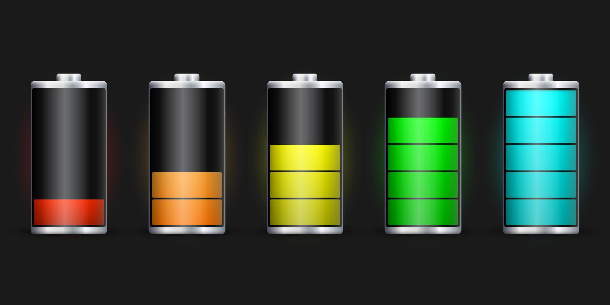

# battery-led-card

**v4.5.1** — zwei Karten aus einer Datei

Zwei Lovelace-Karten, eine Datei, eine Ressource:

| Typ | Für |
|---|---|
| `custom:battery-led-card` | Batterien — Stand in %, Prozentanzeige, Knopf zum Einsammeln |
| `custom:led-gauge-card` | beliebige Zahlenwerte — `min`/`max` je Zeile, Rohwert mit Einheit |

Beide teilen sich Balken, Farben, Schwellen, Ladefluss und Editor; unten steht, wo sie sich
unterscheiden.

Batterie-Entitäten als quer liegendes LED-Segmentpanel (Vorlage: `led.jpg`,
aber horizontal und mit mehr Balken). Eine Zeile pro Entität, Klick öffnet den More-Info-Dialog.
Konfiguration komplett über den grafischen Editor.



## Installation

**Manuell**

1. `battery-led-card.js` nach `config/www/` kopieren.
2. Einstellungen → Dashboards → ⋮ → Ressourcen → **+ Ressource hinzufügen**:
   URL `/local/battery-led-card.js?v=1`, Typ **JavaScript-Modul**.
   (Menüpunkt nur sichtbar bei aktiviertem *Erweiterten Modus* im Benutzerprofil.)
3. Strg+F5. Karte erscheint im Picker als **Battery LED Card** (mit Vorschau).

Bei Dashboards im YAML-Modus stattdessen in `configuration.yaml` unter
`lovelace: resources:` eintragen (`url` + `type: module`) und HA neu starten.

**HACS**: Repository als *Dashboard*-Quelle hinzufügen, `hacs.json` liegt bei.

## Konfiguration

```yaml
type: custom:battery-led-card
title: Batterien
segments: 12
columns: 2
bar_height: 22
name_width: auto
state_width: auto
cap: true
cap_size: 5
show_icon: true
show_name: true
show_state: true
show_flow: true
animate_flow: true
flow_full_scale: 3000
sort: true
color_mode: segment
warn_below: 15
show_last_changed: true
deadband: 5
thresholds: { critical: 10, low: 30, medium: 50, high: 80 }
colors:
  critical: tomato
  low: "#ffa500"
  full: 32cd32
entities:
  - sensor.handy_akku
  - entity: sensor.hausspeicher_soc
    name: Hausspeicher
    charge: sensor.speicher_ladeleistung
    discharge: sensor.speicher_entladeleistung
    deadband: 20
```

| Option | Typ | Default | Bedeutung |
|---|---|---|---|
| `entities` | list | – | Entity-IDs oder Objekte (s.u.); entfällt bei `auto: true` |
| `title` | string | – | Kartenüberschrift, weglassen = keine |
| `segments` | 1–40 | `12` | Anzahl LED-Balken pro Zeile |
| `columns` | 1–6 | `1` | Spalten im Raster |
| `bar_height` | 8–80 px | `22` | Höhe der Balken (Breite läuft responsiv mit) |
| `row_gap` | 0–40 px | `8` | Abstand zwischen Symbol, Name, Balken, Pfeil und Wert |
| `name_width` | CSS-Länge \| `auto` | `30%` | Breite der Beschriftung. `auto` misst den längsten Namen aus, alles andere wird direkt übernommen (`120px`, `10em`, `40%`) |
| `precision` | 0–5 | – | Nachkommastellen des angezeigten Werts. Leer = wie die Entität liefert (Batteriekarte: ganze Prozent). Formatiert in der HA-Sprache, also `3,8` statt `3.8` |
| `state_width` | CSS-Länge \| `auto` | `3.2em` | Breite der Wertespalte rechts. `auto` misst den längsten Wert aus — bei der Gauge Card mit Einheiten meist die bessere Wahl |
| `show_icon` | bool | `true` | Symbol ganz links anzeigen |
| `show_name` | bool | `true` | Beschriftung links anzeigen |
| `show_state` | bool | `true` | Prozentwert rechts anzeigen |
| `show_flow` | bool | `true` | Ladefluss-Pfeil (▲/▼) anzeigen |
| `animate_flow` | bool | `true` | Pfeil läuft in Flussrichtung, Tempo nach Stärke |
| `flow_style` | `arrow` \| `alternate` | `arrow` | `arrow`: eigene Spalte neben dem Balken. `alternate`: die Wertespalte zeigt im Wechsel Wert und Richtung (alle 2,5 s) und spart damit eine Spalte |
| `peak` | bool | `false` | Peak-Hold-Marke: ein einzelnes Segment bleibt am zuletzt erreichten Höchstwert stehen, während der Balken darunter zurückgeht — die Konvention vom Pegelmeter |
| `peak_hold` | 1–86400 s | `60` | So lange hält die Marke, danach folgt sie dem aktuellen Wert |
| `pulse_travel` | 0,2–20 s | `1.5` | Dauer eines Durchlaufs über die ganze Breite — das **Tempo**, gilt für `pulse` und `fill` |
| `pulse_period` | 1–60 s | `3` | Zeit von einem Durchlauf zum nächsten — der **Abstand**. Ändert das Tempo nicht; was über `pulse_travel` hinausgeht, ist Standzeit. Kleiner als `pulse_travel` lassen die Durchläufe überlappen |
| `pulse_width` | 1–8 | `2` | Wie viele Segmente gleichzeitig aus sind — die Breite des wandernden Lochs |
| `blink_tip` | bool | `false` | Lässt die Spitze zusätzlich zur gewählten Animation blinken, sobald eine Richtung erkannt ist. Bei `fill` und `pulse` kombinierbar, bei `blink` schon enthalten |
| `animation` | `none` \| `blink` \| `blink_always` \| `pulse` \| `fill` | `none` | `blink`: das letzte leuchtende Segment blinkt, sobald ein Lade-/Entladefluss erkannt ist — in beide Richtungen dasselbe, in der Stufenfarbe des Balkens. `blink_always`: blinkt immer, in der Stufenfarbe, ohne Richtungsaussage. `pulse`: ein dunkles Segment wandert über den leuchtenden Teil, beim Laden nach rechts, beim Entladen nach links; Tempo und Wiederholrate über `pulse_travel`, `pulse_period` und `pulse_width`. Nahe am Verhalten vor 4.2.0 liegt
`pulse_travel: 3`, `pulse_period: 3`, `pulse_width: 3` — durchgehende Welle ohne Pause. `fill`: die Segmente bis zum Stand leuchten gedimmt und werden der Reihe nach voll hell — beim Laden von 0 nach oben, beim Entladen wird dieselbe Bewegung rückwärts abgespielt, oben geht zuerst aus. Der Füllstand bleibt dabei jederzeit ablesbar, weil nichts ganz ausgeht. Gefüllt wird in `pulse_travel`, danach steht der Balken bis `pulse_period` um ist. Blinken und Pfeil folgen dagegen der Leistung (1,8 s bei ~0 bis 0,35 s ab `flow_full_scale`; ohne messbare Leistung 1,1 s) |
| `flow_full_scale` | number | `1000` | Wert, ab dem die Animation am schnellsten läuft (Einheit der Leistungssensoren) |
| `cap` | bool | `true` | Pluspol rechts am Balken anzeigen |
| `frame_width` | 0–6 px | `2` | Stärke des Gehäuserahmens, `0` = kein Rahmen |
| `cap_size` | 1–20 px | `5` | Breite des Pluspols; die Höhe folgt aus `bar_height` und dieser Breite |
| `sort` | bool | `false` | Niedrigster Stand zuerst |
| `preset` | s.u. | `standard` | Fertige Farbrampe (LED-Farben) |
| `surface` | `classic` \| `glass` \| `flat` | `classic` | Gehäuse, unbeleuchtete Segmente und Rahmen |
| `color_state` | bool | `true` | Wert rechts in der Richtungsfarbe, sobald ein Fluss erkannt ist |
| `color_mode` | `level` \| `segment` | `level` | `level`: der ganze Balken trägt die Farbe der aktuellen Stufe. `segment`: jedes Segment hat seine eigene Farbe nach der Schwelle, die es abdeckt — die Rampe läuft dann von links nach rechts durch |
| `warn_below` | 0–100 | `0` | Unter diesem Stand blinkt der Balken, `0` = aus |
| `show_last_changed` | bool | `false` | „vor 3 Stunden" neben dem Namen — entlarvt tote Sensoren |
| `deadband` | number | `1` | Ladefluss-Schwelle (Standard für alle Zeilen), in der Einheit der Leistungssensoren |
| `auto` | bool | `false` | Alle `device_class: battery`-Entitäten einsammeln |
| `auto_area` | list | – | … nur aus diesen Bereichen (Entitäts- oder Gerätebereich) |
| `auto_exclude` | list | – | … diese ausschließen |
| `rebuild_delay` | 0–300 s | `5` | Puffer, bevor eine geänderte Auto-Liste neu gezeichnet wird |
| `thresholds` | map | s.u. | Grenzen der Farbstufen in % |
| `colors` | map | s.u. | Farbe je Stufe (s.u.) |

### Entitäten einsammeln

Beim Hinzufügen der Karte sind die ersten vier gefundenen Batterien vorausgewählt.

Unter **Gewählte Entitäten** hat jede Zeile ihren eigenen aufklappbaren Block: Entitätswahl,
Anzeigename, Ladefluss-Sensoren und Ladefluss-Schwelle — alles an einer Stelle. Ganz unten
steht ein leerer Block **＋ Entität hinzufügen**; sobald dort eine Entität gewählt ist, rückt
sie in die Liste und ein neuer leerer Block erscheint. Eine Zeile entfernt man, indem man ihr
Entitätsfeld leert.

Der Knopf **Batterien einsammeln** hängt alle noch nicht gelisteten
`device_class: battery`-Entitäten auf einen Schlag an.

Wer die Liste stattdessen *laufend* automatisch pflegen lassen will, setzt `auto: true` von
Hand im YAML — dann gelten `auto_area`, `auto_exclude` und `rebuild_delay`. Manuell gelistete
Entitäten stehen dabei immer vorn, der Rest wird dublettenfrei angehängt.

Ändert sich die Auto-Liste (Gerät taucht auf oder fällt weg), zeichnet die Karte die Zeilen
nicht sofort neu, sondern erst nach `rebuild_delay` Sekunden — ein flatternder Sensor lässt die
Karte damit nicht zucken. Bis dahin läuft die alte Zeilenliste weiter; eine verschwundene
Entität steht solange grau auf `n/a`. Der Timer wird bewusst *nicht* nachgetriggert, sonst
würde Dauerflattern den Umbau endlos verschieben. `0` = sofort.

### Eintrag je Entität

| Schlüssel | Bedeutung |
|---|---|
| `entity` | Pflicht |
| `name` | Anzeigename statt `friendly_name` / Entity-ID |
| `icon` | Symbol statt dem der Entität, z. B. `mdi:home-battery` |
| `precision` | Nachkommastellen nur für diese Zeile |
| `charging` | `binary_sensor`, `on` = lädt |
| `power` | ein vorzeichenbehafteter Sensor: `+` lädt, `−` entlädt |
| `charge` + `discharge` | zwei getrennte Leistungssensoren, der größere gewinnt |
| `deadband` | Ladefluss-Schwelle nur für diese Zeile, sonst gilt der Kartenwert |

Gedacht ist das für Hausspeicher (LG, Marstek, Solix …), die neben dem Ladezustand
Leistungssensoren mitbringen. Für Geräteakkus lässt man die Felder einfach leer, dann bleibt
die Pfeilspalte leer — oder man schaltet sie per `show_flow: false` ganz ab.

Ergebnis ist ein Chevron neben dem Balken: **▲ grün** = wird geladen, **▼ orange** = wird
entladen, nichts = Ruhe oder unbekannt. Mit `animate_flow` läuft der Pfeil in Flussrichtung;
das Tempo steigt mit der Leistung — von 2 s pro Durchlauf bei ~0 auf 0,5 s ab
`flow_full_scale`. Ein reiner Lade-Binärsensor liefert keine Stärke, der Pfeil läuft dann mit
mittlerem Tempo. `prefers-reduced-motion` schaltet alle Animationen ab. Die drei Quellen werden in obiger Reihenfolge geprüft,
`charging: off` heißt ausdrücklich *nicht* „entlädt" — ein Lade-Binärsensor weiß das nicht.
Werte unterhalb der Ladefluss-Schwelle gelten als Ruhe.

### Farbvoreinstellungen (`preset`)

| Wert | Rampe |
|---|---|
| `standard` | tomato → orange → gold → yellowgreen → limegreen |
| `led-classic` | rot → orange → gelb → grün → cyan, wie `led.jpg` |
| `ampel` | gedeckte Ampelfarben, `#d32f2f` → `#388e3c` |
| `neon` | knallig, für dunkle Themes |
| `mono` | alle Stufen in `var(--primary-color)` — Länge zählt, nicht Farbe |
| `invers` | blau → grün → gelb → orange → rot, also **voll = rot**: für Werte, bei denen hoch schlecht ist (Temperatur, Füllstand eines Abwassertanks) |

```yaml
preset: ampel
colors:
  critical: "#000"      # einzelne Stufe trotzdem selbst setzen
```

Die Platzhalter im Farbeditor zeigen immer die Werte der gewählten Voreinstellung.

### Gehäuse (`surface`)

| Wert | Körper | Unbeleuchtet | Rahmen |
|---|---|---|---|
| `classic` | `#111111` | `#262626` | `var(--divider-color)` |
| `glass` | Textfarbe 7 % auf transparent | 18 % | 25 % |
| `flat` | `transparent` | Textfarbe 15 % | keiner |

`classic` ist der schwarze Batteriekörper aus `led.jpg` und die Voreinstellung — passt zu den
Standard-Themes, hell wie dunkel. **`glass`** ist für Themes mit durchscheinenden oder
verlaufenden Karten (z. B. *kibbit-dark-cards*): nichts wird übermalt, die Karte scheint
durch, im hellen Theme kippt derselbe Schleier ins Dunkle. `flat` lässt das Gehäuse ganz weg.

Einzelne Werte übersteuerst du wie gehabt über `colors.body`, `colors.off`, `colors.frame` —
die schlagen sowohl `surface` als auch `preset`.

### Farbstufen

| Schlüssel | Default-Schwelle | Default-Farbe |
|---|---|---|
| `critical` | < 10 % | `#ff6347` tomato |
| `low` | < 30 % | `#ffa500` orange |
| `medium` | < 50 % | `#ffd700` gold |
| `high` | < 80 % | `#9acd32` yellowgreen |
| `full` | Rest | `#32cd32` limegreen |
| `off` | – | unbeleuchtete Segmente — per Default aus dem Theme gemischt |
| `body` | – | Gehäuse hinter den Segmenten — per Default aus dem Theme gemischt |
| `frame` | – | Rahmen und Pluspol, Default `var(--divider-color)` |
| `pos` | – | Richtung positiv (lädt / steigt), Default `var(--success-color)` — färbt Pfeil und Wert, nicht die Segmente |
| `neg` | – | Richtung negativ (entlädt / fällt), Default `var(--error-color)`, also rot |

Im Editor gibt es zwei Wege: **Farben (Theme)** mit dem HA-eigenen Farbwähler (Theme-Farben
wie *red*, *primary*, *accent*) und darunter **Farben — eigene Werte** mit Farbwähler plus
Textfeld für alles andere. Beide schreiben denselben Schlüssel, leer = Default.
Farbwerte dürfen sein: `#2ed0d8`, `2ed0d8` (Raute wird ergänzt), `#2ed0d8ff` mit Alpha,
`rgba(46,208,216,0.4)`, `rgb(46 208 216 / 40%)`, `hsla(…)`, `#2ed0d866` und `2ed0d866`
(8-stellig = mit Alpha), `[46,208,216]` und `[46,208,216,0.4]` als Liste,
Namen wie `red` oder `tomato` (wird zu `var(--red-color, red)`: Theme-Farbe wenn das Theme sie
kennt, sonst der gleichnamige CSS-Wert), Theme-Namen mit Bindestrich wie `deep-purple`,
`rgb(46,208,216)`, `var(--error-color)` — oder weiterhin `[46,208,216]` aus älteren Configs. `thresholds` und `colors` sind unabhängig voneinander.

### Theme

Die Karte nimmt die Theme-Variablen, wo es welche gibt: Kartenhintergrund und -rand von
`ha-card`, `--ha-card-header-font-size`/`-font-family`/`-color` für den Titel,
`--primary-text-color` für Namen, `--secondary-text-color` für Wert und Zeit,
`--divider-color` für Gehäuserahmen und Pluspol, `--state-icon-color` fürs Symbol,
`--error-color` für die Warnung, `--success-color`/`--warning-color` für den Pfeil,
`--disabled-text-color` für Zeilen ohne Wert.

Gehäuse, unbeleuchtete Segmente und Rahmen sind Schleier aus der Textfarbe gegen
`transparent` (`color-mix` mit 7 %, 18 % und 25 %) — also **kein eigener Hintergrund**. Damit
scheint die Karte durch, auch bei Themes mit durchscheinenden oder verlaufenden Karten; im
hellen Theme wird derselbe Schleier dunkel statt hell. Die LED-Farben selbst bleiben fest,
sonst wäre die Rampe in jedem Theme anders.

Den klassischen schwarzen Batteriekörper aus `led.jpg` bekommst du unabhängig vom Theme mit:

```yaml
colors:
  body: "#111111"
  off: "#262626"
  frame: "#9e9e9e"
```

Und ganz ohne Gehäuse, nur Segmente auf der Karte:

```yaml
frame_width: 0
colors:
  body: transparent
```

### Wertermittlung

numerischer State → Attribut `battery_level` → `binary_sensor` (`on` = leer, `off` = voll)
→ sonst `n/a` (graue Zeile, keine Segmente).

## Version

`VERSION` steht oben in `battery-led-card.js`. Sie erscheint unten im GUI-Editor, in der
Beschreibung im Karten-Picker und als Banner in der Browser-Konsole — praktisch um zu prüfen,
ob der Browser die neue Datei geladen hat (Cache!).

## `custom:led-gauge-card` — beliebige Werte

Gleiche Optionen wie oben, plus:

| Option | Typ | Default | Bedeutung |
|---|---|---|---|
| `min` | number | `0` | Wert, der 0 % entspricht (Karte) |
| `max` | number | `100` | Wert, der 100 % entspricht (Karte) |
| `trend_flow` | bool | `true` | Pfeil aus dem eigenen Verlauf, wenn keine Ladefluss-Sensoren angegeben sind. Nur hier an — die Batteriekarte lässt ihn aus, ein um 1 % fallender Akku braucht keinen Pfeil |
| `trend_deadband` | 0–100 % | `0.5` | Änderungen kleiner als dieser Wert (in % der Skala) gelten als Ruhe — das Gegenstück zu `deadband` auf der Batteriekarte. Auch je Zeile setzbar |
| `trend_hold` | 10–86400 s | `300` | So lange bleibt der Pfeil nach der letzten Änderung stehen, und so weit blickt die History-Abfrage zurück |
| `trend_history` | bool | `true` | Beim Laden einmal HA nach dem Verlauf fragen, damit der Pfeil sofort stimmt |
| `trend_full_scale` | number | `5` | Änderung in %/min, ab der die Animation am schnellsten läuft |

`min`/`max` gibt es auch je Zeile und schlagen dann den Kartenwert. Ohne Angabe gilt 0–100,
die Karte verhält sich dann wie die Batterievariante.

```yaml
type: custom:led-gauge-card
title: Speicher & Tanks
segments: 20
color_mode: segment
entities:
  - entity: sensor.zisterne_fuellstand
    name: Zisterne
    min: 0
    max: 5000
  - entity: sensor.heizoel_liter
    name: Heizöl
    max: 3000
  - sensor.luftfeuchte_bad          # ohne min/max: 0–100
```

Angezeigt wird rechts der **Rohwert mit Einheit** (`3240 l`), nicht der Prozentsatz — der
steckt in der Balkenlänge.

Die Ladefluss-Sensoren (`charging`, `power`, `charge`/`discharge`, `deadband`) gibt es hier
nicht — bei einem Füllstand hat „lädt" keine Bedeutung. Stattdessen der **Trend-Pfeil**: die
Karte beobachtet den Wert selbst, steigt er zeigt der Pfeil hoch, fällt er runter, Tempo nach
Änderung pro Minute. Beim Aufbau holt sich die Karte einmal den Verlauf der letzten `trend_hold` Sekunden
(`history/history_during_period`, ein Aufruf für alle Zeilen zusammen) — der Pfeil steht damit
sofort richtig, statt erst nach der ersten beobachteten Änderung. Danach läuft es ohne weitere
Abfragen aus den laufenden State-Updates. Ist die History-Integration aus oder scheitert der
Aufruf, bleibt es beim alten Verhalten: Pfeil ab der ersten Änderung. Abschaltbar mit
`trend_history: false`.

(In YAML funktionieren die Sensorfelder weiterhin, sie stehen nur nicht im Editor.)

## Testsensoren

`testsensoren.yaml` enthält vier Template-Sensoren zum Ausprobieren der Animationen, ohne auf
eine echte Batterie zu warten: **fallend** und **steigend** (je 5 Minuten von 0 auf 100 bzw.
zurück), **pendelnd** (Dreieck ohne Sprung, 10 Minuten pro Runde) und **Testleistung**
(+2000 / −2000 W, passend zum Pendel). Einfügen, YAML-Konfiguration neu laden, fertig — kein
Neustart.

```yaml
type: custom:led-gauge-card
title: Animationstest
segments: 24
animation: pulse
peak: true
entities:
  - entity: sensor.testwert_pendelnd
    name: Pendel
  - entity: sensor.testwert_steigend
    name: Steigend
  - entity: sensor.testwert_fallend
    name: Fallend
trend_full_scale: 20
trend_hold: 60
```

Für die Batteriekarte stattdessen `sensor.testwert_pendelnd` mit
`power: sensor.testleistung` — dann kommt die Richtung aus der Leistung statt aus dem Trend.

## Test

`node test.mjs` — läuft beides: die Logiktests und anschließend `test-render.mjs`, das die
Karte in einem Mini-DOM tatsächlich rendert (beide Kartentypen, jede Betriebsart, Randfälle
wie leere Liste oder kaputter Sensor). Der Rendertest prüft nicht das Aussehen, sondern dass
der Renderpfad ohne Ausnahme durchläuft.

Geprüft werden: Farbstufen und Schwellen, Farbnormalisierung, Segmentberechnung,
Wertermittlung, Ladefluss-Logik, Auto-Sammlung inkl. Bereichsfilter, relative Zeit,
Editor→Config-Umwandlung.
